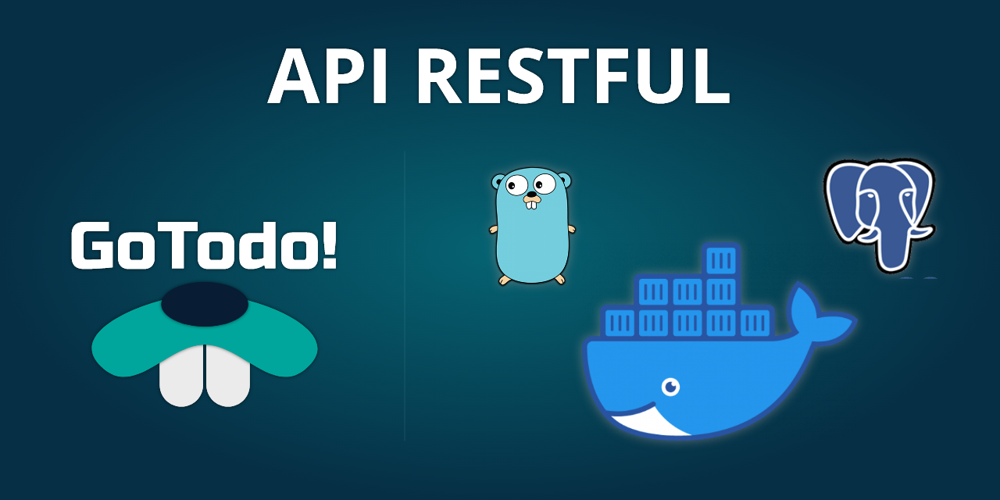

# GoTodo! API RESTful



## How to use this project?

### Requirements
* Docker 19.03
* Go 1.13 (docker image)
* Postgres 10 (docker image)
* Postman 7.6.0 

### Run

* ```
  docker-compose up
  ```